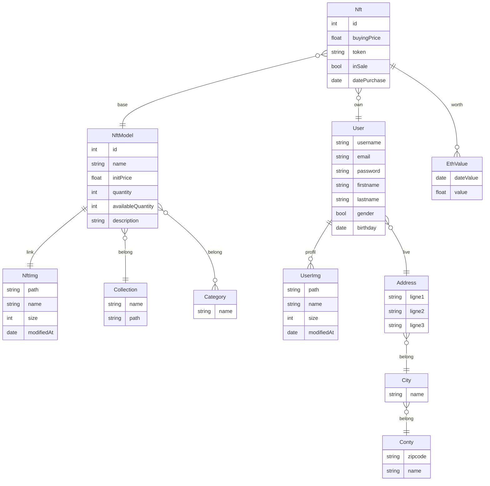

# BUSINESS CASE 2022 DWWM : Create your Avatar

## Préambule

Projet réaliser pour la soutenance de ma formation Developpeur Web et web mobile.  

Il s'agit de la partie Front end de mon site CreateYourAvatar.fr  

La partie back end se trouve sur le repo github : [CreateYourAvatar_Back_End](https://github.com/Adil-be/CreateYourAvatar_Back_End)

## Development server

Le projet est déployé a l'adresse : [CreateYourAvatar.fr](CreateYourAvatar.fr)

## Architecture du projet

La plateforme de Tatty Josy sera divisée en deux parties :

- L’application autour des NTFs
- L’administration des données

La partie application, sera disponible publiquement. Un utilisateur aura la possibilité de parcourir le site en tant
qu’anonyme ou bien en étant inscrit.
Lorsque l’utilisateur sera anonyme, il aura accès à :

- Une page d’accueil présentant le projet
- La liste des NFTs disponibles (avec des informations autour de ces derniers)
- La page détaillée d’un NFT lorsqu’on clique dessus

La partie intéressante du projet intervient lorsque l’utilisateur sera connecté. Il aura évidemment accès à la partie
publique cependant le but de la plateforme est de permettre à l’utilisateur de créer une sorte de galerie de tous
les NFTs qu’ils possèdent en rapport à la plateforme.

Cependant, il devra rentrer manuellement les NFTs qu’ils possèdent sur son compte.

Enfin, sa galerie lui affichera des graphiques et des informations autour des cryptomonnaies afin de traquer la
valeur de ses investissements.

La partie administrative sera disponible uniquement pour Josianne. Elle permettra la gestion de toutes les
informations disponibles sur le site, c’est-à-dire, la lecture, l’écriture, la modification et la suppression des :

- NFTs
- Utilisateurs
- Catégories & Sous-catégories

## Page accueil

La page d’accueil reprendra les codes de présentation d’un projet digital :

- Un header avec un Call To Action fort
- Une section présentation de l’entreprise
- Une section présentant le projet
- Une section vulgarisant ce qu’est un NFT pour rendre le projet accessible à tout le monde
- Possibilité d’ajouter d’autres sections à votre convenance et en rapport à la thématique choisie

## Page détaillée d’un NFT

Tout comme une action en bourse ou un tableau dans une galerie d’art, un NFT possède un cours.

Ce cours est toujours associé à une cryptomonnaie, les NFTs ne s’achètent jamais en EUR ou en USD.

Dans notre cas, nous partirons du principe que les NFTs de la plateforme seront reliés au cours de l’ETH. (Ethereum)

Pour plus de simplicité, nous partirons du principe que le cours du NFT ne change qu’une fois par jour à 23h30. (En
temps normal, le cours change de manière constante durant la journée sans interruption).

Cela signifie que pour
tracer un cours sur 7 jours, nous aurons 7 valeurs stockées en BDD pour chaque NFT.

Enfin, chaque NFT est unique, cependant, un NFT peut être libéré dans une quantité variable.

La page détaillée du NFT permettra d’afficher entre autres :

- Son image
- Son nom
- Le nombre disponible
- Sa valeur actuelle sur le marché
- Son cours sur les 7 derniers jours (graphique)
- Un tableau listant les propriétaires par rapport au nombre disponible (il se peut que certains NFTs ne
  soient pas encore achetés par qui que ce soit)

BUSINESS CASE 2022
DWWM
Les deux grandes différences avec les NFTs sont :

- La traçabilité incorruptible offerte par la blockchain
- Le fait que les NFTs sont forcément reliés au monde digital et ne seront jamais physiques

La page détaillée du NFT permettra d’afficher entre autres :

- Son image
- Son nom
- Le nombre disponible
- Sa valeur actuelle sur le marché
- Son cours sur les 7 derniers jours (graphique)
- Un tableau listant les propriétaires par rapport au nombre disponible (il se peut que certains NFTs ne
  soient pas encore achetés par qui que ce soit)

## Page dashboard galerie

L’utilisateur pourra créer sa galerie afin de traquer les performances de ses investissements sur la plateforme.

La galerie permettra, évidemment, de gérer en CRUD les NFTs que l’utilisateur connecté possède. (voir, ajouter, modifier, supprimer un NFT)

Comme tout investissement, le dashboard permettra à l’utilisateur d’avoir accès à différentes informations
importantes :

- La valeur globale d’achat de sa galerie
- La valeur globale à l’instant T de sa galerie
- La performance globale de sa galerie sur J-1 (% positif ou négatif de gain)
- La valeur d’achat par NFT
- La valeur à l’instant T par NFT (au total et par unité)
- La performance sur J-1 par NFT (% positif ou négatif de gain)
- Le prix à l’instant T d’un ETH en EUR
- Un graphique retraçant le cours de l’ETH sur les 7 derniers jours

## APPLICATION

La plateforme publique sera développée intégralement en Angular et Bootstrap avec l’utilisation d’une API faite
en Symfony pour les données de la plateforme et l’utilisation d’une API gratuite et tiers pour la partie cours des cryptomonnaies (l’API en question)

La plateforme devra permettre un accès de manière anonyme à certaines pages ainsi qu’un accès non
anonyme, notamment pour la gestion de la galerie de l’utilisateur connecté.

De plus, il sera nécessaire de gérer l’inscription ainsi que l’authentification de l’utilisateur (grâce à un jeton)

## ADMINISTRATION

La partie administration du projet sera réalisée avec la technologie Symfony et Bootstrap.

Elle doit permettre au client de manager toutes les données de sa plateforme.

Il devra ainsi pouvoir consulter,
créer, modifier ou supprimer des :

- NFTs
- Utilisateurs
- Catégories et sous-catégories

Pour chaque CRUD, il sera possible d’effectuer des tris ou une recherche.
Pour la partie Read, l’affichage sous tableau, vous prendrez la décision sur les données à afficher pour ne pas
surcharger l’affichage.

L’administration sera évidemment sécurisée par une authentification à jeton.

Vous générerez le compte
permettant l’authentification avec les informations de connexion suivantes :

- Nom d’utilisateur : TattyJosy
- Password : LaJosCasseLaBaraque

# Mcd

